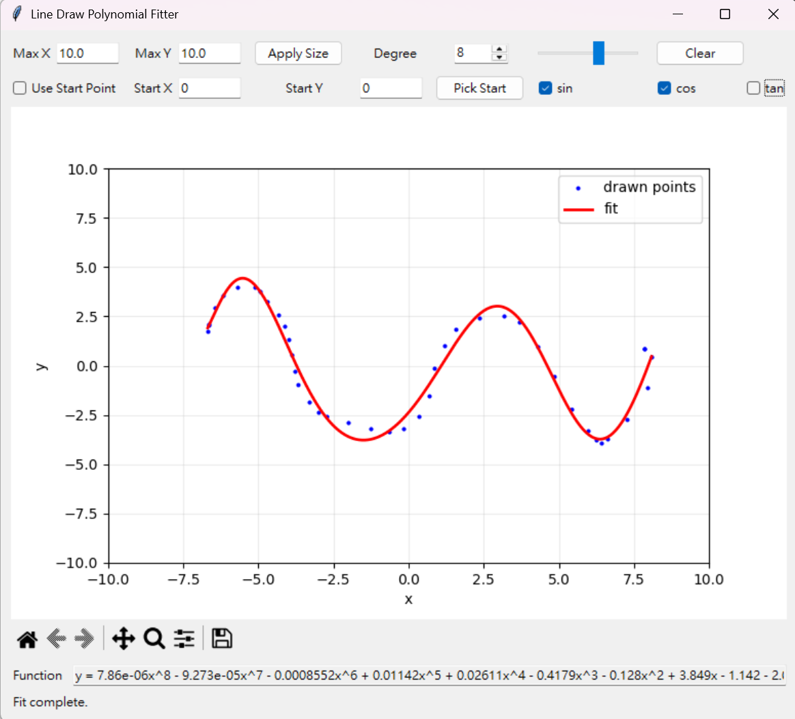

# Line Draw Polynomial Fitter

Draw a curve with your mouse and turn it into a fitted mathematical function.

Line Draw Polynomial Fitter is a lightweight Python desktop app for sketching points on a graph and fitting them with a polynomial curve. It uses linear regression curve fitting with least-squares estimation to match the drawn path as closely as possible. It is useful for quick visual experiments, math demos, curve approximation, and exploring how polynomial degree and trigonometric basis terms affect a fitted function.

## Features

- Draw directly on a Matplotlib graph with the left mouse button.
- Fit the drawn path to a polynomial function.
- Adjust the polynomial degree from 1 to 12.
- Optionally include `sin(x)`, `cos(x)`, and `tan(x)` terms in the fitting basis.
- Set custom X and Y graph limits.
- Pick or manually enter a fixed start point.
- View the generated equation immediately in the app.
- Clear the canvas and redraw without restarting.

## Preview



## Requirements

- Python 3.10 or later
- Tkinter
- NumPy
- Matplotlib

Tkinter is included with most standard Python installations. If your Python distribution does not include it, install the Tkinter package for your operating system.

## Installation

Install dependencies:

```bash
pip install -r requirements.txt
```

## Usage

Run the app:

```bash
python app.py
```

Then:

1. Set the graph size with `Max X` and `Max Y` if needed.
2. Choose a polynomial degree.
3. Hold the left mouse button and draw inside the graph.
4. Release the mouse button to fit the curve.
5. Read the generated function from the `Function` field.
6. Toggle `sin`, `cos`, or `tan` if you want to include trigonometric terms.
7. Use `Clear` to start again.

## How It Works

The app records points from your mouse movement, groups nearby duplicate X values, and fits the resulting data with a linear regression curve fitting model using NumPy and least-squares estimation.

By default, the model uses polynomial terms:

```text
y = a_n*x^n + ... + a_2*x^2 + a_1*x + a_0
```

When enabled, extra trigonometric basis terms are added:

```text
y = polynomial(x) + b*sin(x) + c*cos(x) + d*tan(x)
```

The fitted curve is drawn back onto the graph, and the formatted equation is displayed in the app.

## Project Structure

```text
line_draw/
├── app.py              # Tkinter application and curve fitting logic
├── requirements.txt    # Python dependencies
└── README.md           # Project documentation
```

## Tech Stack

- Python
- Tkinter
- NumPy
- Matplotlib

## Notes

- Very high polynomial degrees can overfit short or noisy drawings.
- `tan(x)` can become unstable near asymptotes, so the app skips unstable tangent values during fitting.
- The fitted equation is intended for quick exploration and visualization, not precision scientific modeling.

## License

MIT License

Copyright (c) 2026

Permission is hereby granted, free of charge, to any person obtaining a copy
of this software and associated documentation files (the "Software"), to deal
in the Software without restriction, including without limitation the rights
to use, copy, modify, merge, publish, distribute, sublicense, and/or sell
copies of the Software, and to permit persons to whom the Software is
furnished to do so, subject to the following conditions:

The above copyright notice and this permission notice shall be included in all
copies or substantial portions of the Software.

THE SOFTWARE IS PROVIDED "AS IS", WITHOUT WARRANTY OF ANY KIND, EXPRESS OR
IMPLIED, INCLUDING BUT NOT LIMITED TO THE WARRANTIES OF MERCHANTABILITY,
FITNESS FOR A PARTICULAR PURPOSE AND NONINFRINGEMENT. IN NO EVENT SHALL THE
AUTHORS OR COPYRIGHT HOLDERS BE LIABLE FOR ANY CLAIM, DAMAGES OR OTHER
LIABILITY, WHETHER IN AN ACTION OF CONTRACT, TORT OR OTHERWISE, ARISING FROM,
OUT OF OR IN CONNECTION WITH THE SOFTWARE OR THE USE OR OTHER DEALINGS IN THE
SOFTWARE.
